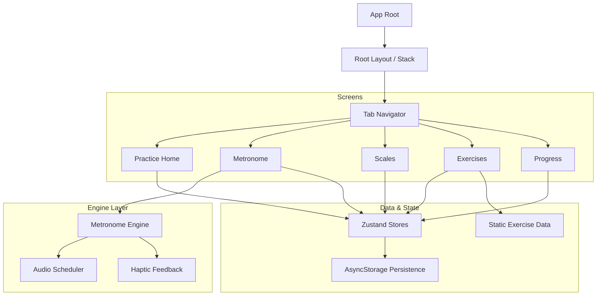
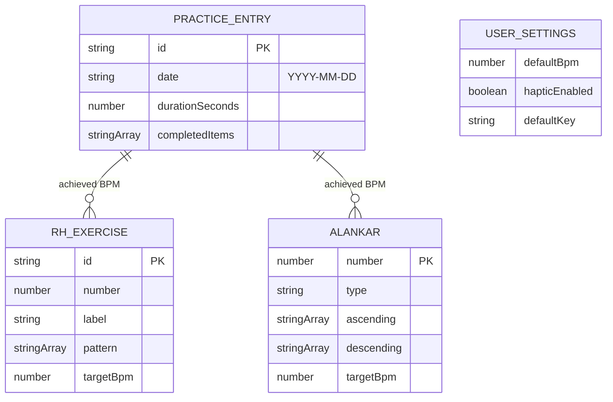

# Guitar Practice App (Riiyazi)

A state-of-the-art, premium guitar practice companion built with **React Native + Expo SDK 54**. Designed for both modern pedagogy and high-performance practice, featuring the signature "Midnight & Amber" UI.

---

## ✨ Design Philosophy: Midnight & Amber
The application is built on a design system optimized for low-light practice environments and high visual focus:
- **Aesthetics**: OLED-black backgrounds with vibrant amber (#FF6B00) and cyan (#00E5FF) highlights.
- **Responsiveness**: A custom scaling engine (`rs`/`rf` utilities) ensures pixel-perfect layouts across all mobile and tablet devices.
- **Safe Area Mastery**: Multi-edge safe area handling optimized for notches, home indicators, and tab-bar transparency.

---

## 🛠 Feature Overview

| Module | Purpose | Key Features |
|---|---|---|
| **Practice Home** | The Daily Hub | Session timer, routine checklist, streak tracking, and weekly goal progress. |
| **Tempo (Metronome)** | Precision Timing | Circular SVG arc dial with **Rotary Pan Gestures**, Tap Tempo, and Linear BPM Ramping. |
| **Scales** | Visual Mastery | SVG Fretboard diagrams with glow-dot indicators and multi-position key selection. |
| **Exercises** | Technique Library | Right-Hand picking, Left-Hand spider patterns, and Alankars with **Mastery Tracking**. |
| **Progress** | Data Insights | 35-day activity heatmap, BPM records, and session history analysis. |

---

## 🏗 System Architecture



---

## 📊 Data Model (ER Diagram)



---

## 🔄 Detailed User Lifecycle & Navigation Flow

The following diagram illustrates the complete interactive journey from app launch through a high-performance practice session and into progress analysis.

```mermaid
flowchart TD
    %% Entry & Home
    START((App Launch)) --> SPLASH[Splash Screen / Audio Init]
    SPLASH --> DASH[Dashboard / Home]
    
    %% Dashboard Interactions
    DASH --> TIMER[Start Session Timer]
    DASH --> CHECK[Mark Daily Checklist]
    
    %% Navigation Branches
    DASH --> TABS{Navigation Tabs}
    TABS -- Technical --> METRO[Metronome]
    TABS -- Theory --> SCALES[Scales Explorer]
    TABS -- Practice --> EXER[Exercise Library]
    TABS -- Analytics --> PROG[Progress Analytics]
    
    %% Exercise Sub-Flow
    EXER --> EX_TAB{Tab Selection}
    EX_TAB -- RH/LH --> EX_CARD[Exercise Card]
    EX_TAB -- Alankars --> AL_CARD[Alankar Card]
    
    EX_CARD & AL_CARD --> INFO[Open Info Modal / Pedagogy Tips]
    EX_CARD & AL_CARD --> PRAC_DEEP[Start Practice / Deep Link]
    
    %% Deep Link to Metronome
    PRAC_DEEP -- Transfers BPM & Label --> METRO
    
    %% Metronome Interaction
    METRO --> ROTARY[Rotary Dial Gesture]
    ROTARY -- Adjust BPM --> ENGINE[Lookahead Scheduler / Audio Beat]
    METRO --> RAMP[Enable BPM Ramp]
    RAMP --> AUTO_UP[Automatic Speed Increase]
    
    %% Progress Loop
    METRO -- Session Finished --> SAVE[Update BPM Records / Save Session]
    SAVE --> PROG
    
    %% Progress Analytics
    PROG --> HEAT[Check Practice Heatmap]
    PROG --> BADGE[View Level Badges / Mastery]
    
    %% Termination
    PROG --> DASH
    DASH -- Finish Session --> END((Session Logged))

    %% Styles
    style START fill:#FF6B00,stroke:#333,stroke-width:2px,color:#000
    style END fill:#FF6B00,stroke:#333,stroke-width:2px,color:#000
    style METRO fill:#1E1E1E,stroke:#FF6B00,stroke-width:2px
    style EXER fill:#1E1E1E,stroke:#FF6B00,stroke-width:2px
    style DASH fill:#1E1E1E,stroke:#FF6B00,stroke-width:2px
```



### Technical Flow Breakdown

1.  **Audio Initialization**: On launch, the `RootLayout` initializes the `expo-av` audio mode (background playback, silent mode override) and pre-loads the `MetronomeEngine` tick/tock assets to ensure zero-latency first-play.
2.  **Context-Aware Practice**: When a user selects an exercise (e.g., "Alankar 3") and taps "Start Practice," the app performs a **Contextual Deep Link**. It carries the `startBpm` and `label` into the Metronome screen, displaying a "Practice Banner" at the top so the user stays focused on the specific goal.
3.  **The Mastery Feedback Loop**: 
    - **Capture**: Beats achieved during metronome use are compared against target BPMs.
    - **Persistence**: Upon session completion, `practiceStore` stops the timer and `progressStore` serializes the session data to `AsyncStorage`.
    - **Visualization**: The **Progress Heatmap** and **Mastery Progress Bars** instantly update, providing immediate visual gratification and psychological reinforcement.
4.  **Responsive Safety**: All navigation and layout transitions are wrapped in the `Responsive Scaling Engine`, ensuring that the UI remains consistent regardless of whether the user is practicing on a compact phone or a large tablet.

---

## 🚀 Technical Highlights

### 1. High-Precision Metronome Engine
Built using a **Lookahead Scheduler** pattern to eliminate the ±15ms jitter common in JavaScript `setInterval`.
- **Scheduler**: Polls every 25ms.
- **Window**: Schedules audio beats 150ms in advance via `setTimeout`.
- **Rotary UI**: Custom `PanResponder` calculates polar coordinates for an intuitive circular drag experience.

### 2. Responsive Scaling Engine
The app uses a custom `responsive.ts` utility that scales fonts and layout sizes based on screen width, capped for tablet optimization:
- `rs(size)`: Scales layout units.
- `rf(size)`: Scales font sizes.
- `SCROLL_BOTTOM_PAD`: Dynamic padding accounting for Safe Area + Tab Bar height.

---

## 📦 Tech Stack

- **Framework**: Expo (SDK 54) / React Native
- **Routing**: Expo Router (File-based)
- **State**: Zustand + AsyncStorage
- **Graphics**: React Native SVG
- **Animations**: React Native Animated API (Friction/Tension Springs)
- **Audio**: Expo-AV

---

## 🏗 Development & Build

### Auto-Versioning
Configured with **EAS Auto-Increment**.
- **Version Source**: Remote (managed by EAS).
- **Profile**: `preview` (APK) and `production`.

### Setup
```bash
npm install --legacy-peer-deps
npx expo start --clear
```

### Build
```bash
eas build --profile preview --platform android
```

---

## 🛡 Credits & Legal
Developed by **Dr. Dhaval Trivedi**.  
*MIT License © 2026 Dr. Dhaval Trivedi*
